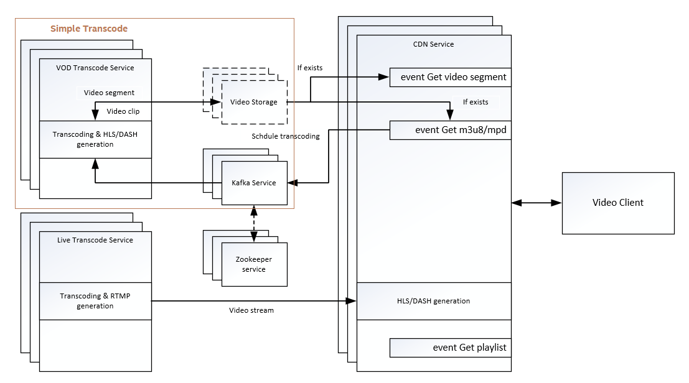

# Open Visual Cloud CDN Transcode Sample

[](https://travis-ci.com/OpenVisualCloud/CDN-Transcode-Sample)
[](https://github.com/OpenVisualCloud/CDN-Transcode-Sample/releases/tag/v1.0)
[](https://github.com/OpenVisualCloud/CDN-Transcode-Sample/blob/master/LICENSE)
[](https://github.com/OpenVisualCloud/CDN-Transcode-Sample/wiki)

The CDN Transcode Sample is an Open Visual Cloud software stack with all required open source ingredients well integrated to provide out-of-box CDN media transcode service, including live streaming and video on demand. It also provides Docker-based media delivery software development environment upon which developer can easily build their specific applications.

# Architecture

The sample implements a reference server-side transcode system over CDN infrastructure, which features `live streaming` and `VOD`.



# What's in this project
The CDN Transcode Sample contains below components:
-  Dockerfiles
-  Python web services source code
-  BASH glue scripts
-  HTML web pages
-  CMakefiles
-  Configuration files
-  Documents

# System requirements
## Operating system
The CDN Transcode Sample may run on Linux* 64 bit operating systems. The list below represents the operating systems that the transcode application and library were tested and validated on:
- Ubuntu* 18.04.2 Server LTS
- CentOS* 7.6

# How to setup The CDN Transcode Sample
## Setup the CDN Transcode Sample OS environment   
Install Ubuntu 18.04.2/CentOS 7.6 on CDN-Transcode Server, and configure the IP address & proxy properly.
### Install ubuntu18.04.2/CentOS 7.6
-  [Download Ubuntu and Install](https://ubuntu.com/download)
-  [Download CentOS and install](https://www.centos.org/download/)

## Setup CDN environment  
### Install the third-party dependency Libraries and tools
```
sudo -E ./script/install_dependency.sh
```
### Setup docker proxy as follows if you are behind a firewall
```
sudo mkdir -p /etc/systemd/system/docker.service.d
printf "[Service]\nEnvironment=\"HTTPS_PROXY=$https_proxy\" \"NO_PROXY=$no_proxy\"\n" | sudo tee /etc/systemd/system/docker.service.d/proxy.conf
sudo systemctl daemon-reload
sudo systemctl restart docker
```
## Build   

Run below commands to build docker images
```
cd CDN-Transcode-Sample
mkdir build
cd build
cmake ..
make
```

---

If you deploy the sample to a cluster, please configure the sample, as `cmake -DREGISTRY=<registry-url> ..`, to push the sample images to the private docker registry after each build.   

To deploy without a private registry, run `make update` after each build to push the sample images to the cluster nodes (which requires passwordless access from the master node to the worker nodes.)   

---

## Deploy
### Auto deployment using Kubernetes

**Tips:** It divides into two parts:   
- [Setup Kubernetes master environment for CentOS](https://github.com/OpenVisualCloud/CDN-Transcode-Sample/wiki/Setup-Kubernetes-master-environment-for-CentOS)
- [Setup Kubernetes master environment for Ubuntu](https://github.com/OpenVisualCloud/CDN-Transcode-Sample/wiki/Setup-Kubernetes-master-environment-for-Ubuntu)
- [Setup Kubernetes worker environment](https://github.com/OpenVisualCloud/CDN-Transcode-Sample/wiki/Setup-Kubernetes-Worker-Environment)   
- [Setup NFS environment](https://github.com/OpenVisualCloud/CDN-Transcode-Sample/wiki/Setup-NFS-environment)

Start CDN transcode service
```
make volume
make start_kubernetes
```
**Tips:** [Configuration example for Kubernetes deploy](https://github.com/OpenVisualCloud/CDN-Transcode-Sample/wiki/Configuration-example-for-Kubernetes-deploy)

Stop CDN transcode service
```
make stop_kubernetes
```

____
### See Also
- [Deploy on Xeon E5 using docker swarm](https://github.com/OpenVisualCloud/CDN-Transcode-Sample/wiki/Deploy-on-Xeon-E5-using-docker-swarm)
- [Deploy on Xeon E5 using Kubernetes](https://github.com/OpenVisualCloud/CDN-Transcode-Sample/wiki/Deploy-on-Xeon-E5-using-Kubernetes)
- [Deploy on Xeon E3 with Gen GFX using Kubernetes](https://github.com/OpenVisualCloud/CDN-Transcode-Sample/wiki/Deploy-on-Xeon-E3-with-Gen-GFX-using-Kubernetes)
- [Deploy on VCA2 with Gen GFX using Kubernetes](https://github.com/OpenVisualCloud/CDN-Transcode-Sample/wiki/Deploy-on-VCA2-with-Gen-GFX-using-Kubernetes)
- [Setup proxy server](https://github.com/OpenVisualCloud/CDN-Transcode-Sample/wiki/Setup-proxy-server)
- [Setup Kubernetes Logging](https://github.com/OpenVisualCloud/CDN-Transcode-Sample/wiki/Setup-Kubernetes-logging-environment)
- [Setup Kubernetes Monitoring](https://github.com/OpenVisualCloud/CDN-Transcode-Sample/wiki/Setup-Kubernetes-monitoring-environment)
- [Remove Kubernetes environment](https://github.com/OpenVisualCloud/CDN-Transcode-Sample/wiki/Remove-Kubernetes-environment)
